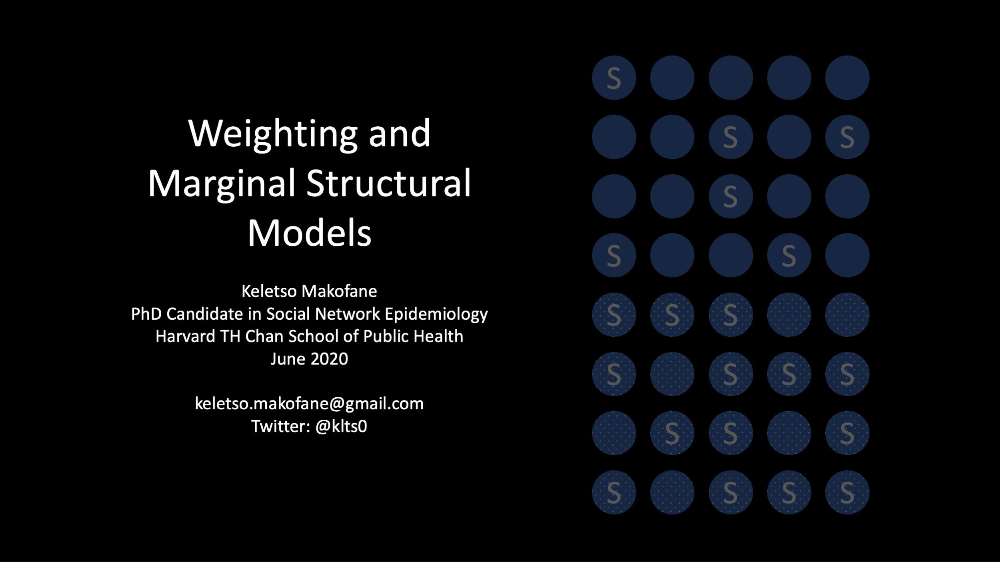
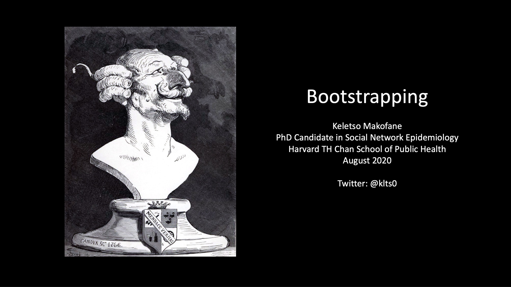
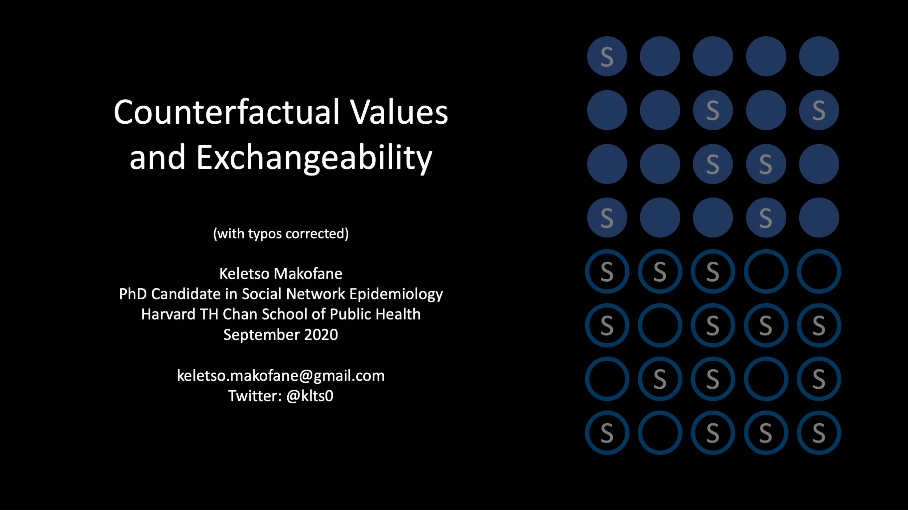
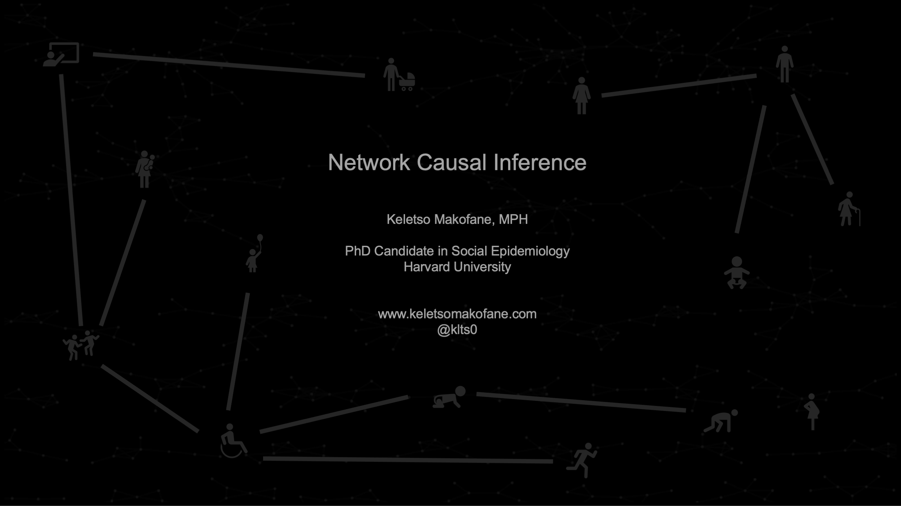

I will update this folder with tweetorials on topics in causal inference and biostatistics. If you use them for teaching, or even for learning, I would love to hear your feedback at kmakofane[at]g[dot]harvard[dot]edu

I am buildling a porfolio as a teacher so please do let me know if these are being used in your courses.

Enjoy!

